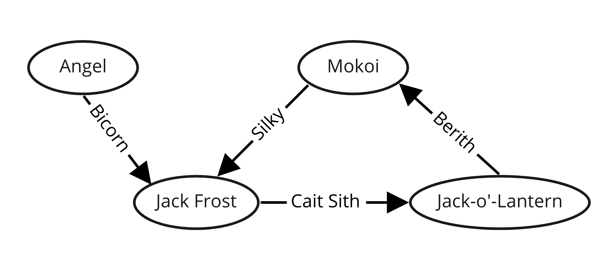
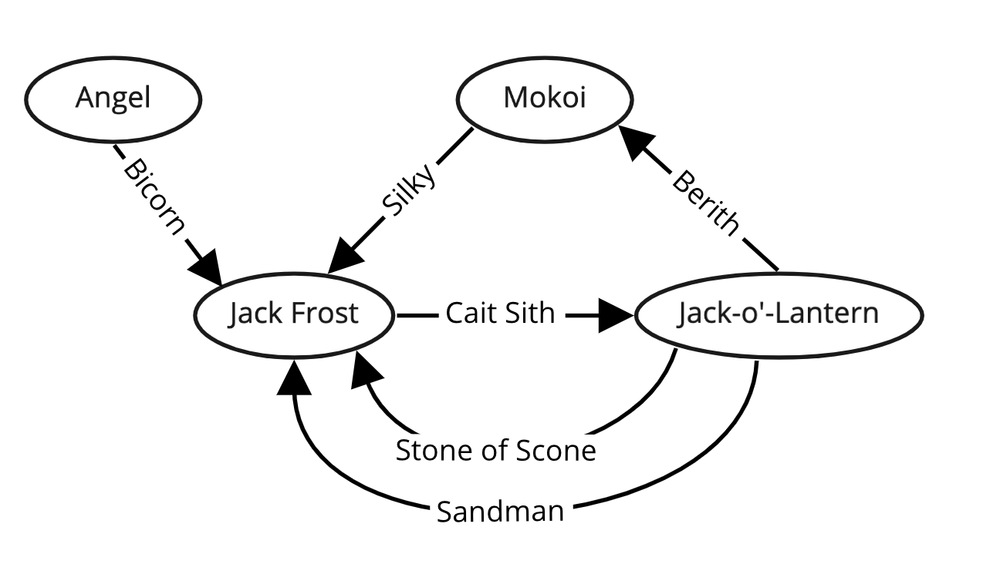
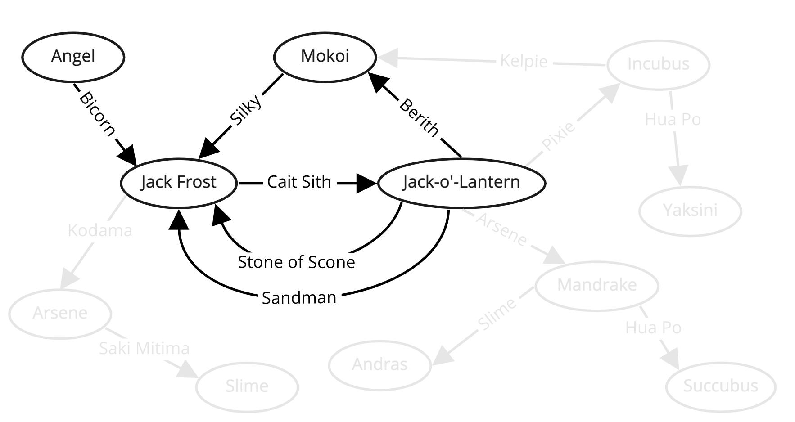

# Persona 5 Graph

An app that builds a Persona Graph. Persona players can use the graph to search for fusion paths based on the personas they have. 

## What is a Persona Graph?

### Intro

When I played Persona 5 Royal for the first time, I had a ton of fun completing the Strength confidant and filling up my compendium. I found the [Persona 5 Calculator](https://chinhodado.github.io/persona5_calculator/indexRoyal.html#/list) which made this much easier. However, I often-times only had a few personas I was willing to fuse and a limited amount of yen I wanted to spend buying from the compendium. I always wanted to find a way to make it easy to search for possible fusions after a few combinations.

_I also later realized that the Persona 5 Calculator only displays the first 20 fusion recipes, and that you have to filter to search the full list for personas you have. I thought the fusion recipes were much more limited than they actually were. I played this game for 170 hours with the calculator open on my laptop the entire time and never realized._

### What is a Graph ?

Say that you are playing Persona 5 Royal without any DLC, and you want to fuse [Jack Frost](https://chinhodado.github.io/persona5_calculator/indexRoyal.html#/persona/Jack%20Frost) (He Ho!) You have Angel and Bicorn, so you decide to fuse the two.

Next, you decide to fuse Jack Frost with Cait Sith to get Jack-o'-Lantern. But you eventually regret this decision as Jack Frost is much _cooler_. You decide to fuse Jack'o-Lantern with Berith to get Mokoi, and then fuse Mokoi with Silky to get back to Jack Frost.

The image below shows what our fusion look like. We call the relationships between these personas a "graph" in computer science.

### We have a graph, what is the point?

This gets more interesting when we consider the many other fusion paths we didn't explore. For example, there are a few direct fusions from Jack-o'-Lantern back to Jack Frost.

And that isn't event mentioning the many other fusions possible to us. This is only scratching the surface.

As I was playing the game, I was really excited by the thought of doing something cool with this graph. My original thought was to simply visualize it. Basically take the image sketched out above and expand it much further. But this quickly became overwhelming. Personas can have over a hundred fusions to and from them. Displaying the graph is not useful.

However, when we just focus on two personas, visualizing this becomes more practical. We can use the graph to figure out how to get from a persona we have to a persona we want.

### How we search

Figuring out how to search was simple. We take a look at a starting persona and just explore every possible path. If we start with Jack-o'-Lantern from the image above, we see the results of fusing him with Berith, Pixie, Arsene, Stone of Scone, and Sandman. The last two will get us to Jack Frost, yay! But the others will result in Mokoi, Incubus, and Mandrake. From there, we explore further. Incubus and Mandrake will never take us on a path that ends up with us fusing to Jack Frost, but Mokoi fused with Silky will get us there.

Tracing these paths manually is pretty tedious! But the nice part is that we have computers to do the searching for us. They can get it done pretty quickly and they never get bored. What we have described is called a search algorithm. This one in particular is called "Depth First Search."

### Limits

If you've used the Persona Graph, you'll noticed that I limit the number of fusions you can search to four. And even choosing four is ill advised. The deeper we search, the more paths we explore and the more time it will take.

If every persona had 100 fusions and you search for two levels of fusions, that is 10 thousand paths to explore (100 * 100). With three, that results in 1 million (100^3). Four, 100 million (100^4). You can see how this adds up quickly! Though computers are fast, there are limits. 

Despite this limitation, it's probably unlikely you'll want to do more than a few fusions to get to your desired persona. Summoning personas to use from the compendium isn't cheap! You'd have to grind Momentos for awhile to save up enough yen. And luckily, that is my favorite feature of the Persona Graph. You can find the least expensive (and lowest level) personas by following the top path on the graph.

You can use all this money saved to visit the Maid Café . . . or whatever it is you like doing after school.

#### A Brief Note on Cost

These costs are approximate. The `Total Cost` seen at the end of the graph doesn't factor into account that you don't have to pay for the persona you already have on each fusion step. However, the costs relative to each other should be accurate. The cheapest path should always be on the top path of the graph. 

## Credits

This project is derivative of the [Persona 5 Calculator](https://github.com/chinhodado/persona5_calculator). The persona data and fusion logic used to build the app are pulled directly from there.

## Contributing

This is a bowl of untested spaghetti code I hacked together in a few days. Feel free to fork this if you want, it's at least well organized spaghetti if anything. I'm not interested in putting the open source level-off-effort that the Persona 5 Calculator has, but I'm open to reviewing PRs if anyone would like to make them.

